```
 _           _         _ _ _                ___   __
| |__   __ _| | __    | (_) |__  _ __ __ _ |__ \ / /_
| '_ \ / _` | |/ /____| | | '_ \| '__/ _` |  ) | '_ \
| |_) | (_| |   <_____| | | |_) | | | (_| | / /| (_) |
|_.__/ \__,_|_|\_\    |_|_|_.__/|_|  \__,_|/____\___/
```

> **Fullstack Developer** // Java · Spring · React

---

<a href="https://bak-libra26.co.kr">
  
</a>

<a href="https://www.insights-korea.com">
  
</a>

---



---



---

<div align="center">
  
</div>
